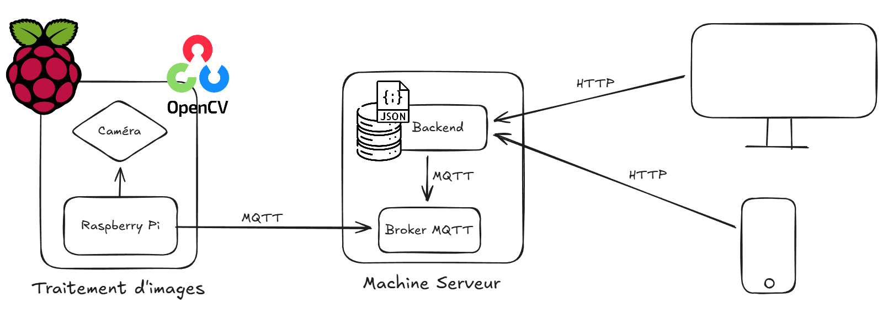

# LiMon: Line Monitoring

3rd year ENSEEIHT Project

LiMon is a line monitoring system that utilizes a Raspberry Pi with a camera to detect and monitor individuals in a specified area. The system employs a YOLO-based face detection model to identify faces and sends the data to a backend server via MQTT. The backend processes the data and provides an API for real-time monitoring and historical analysis.

# Group L3

Aya
Thomas
Gauthier
Farouk
Anton

# Project Architecture



# Components

- **MQTT Broker**: Provides a lightweight messaging protocol for communication between the Raspberry Pi and the backend server.
- **Raspberry Pi**: Captures video feed, processes it using a YOLO-based face detection model, and sends detected face data to the backend via MQTT.
- **Backend Server**: Receives data from the Raspberry Pi, stores it, and provides an API for data retrieval and analysis.
- **Frontend Application**: A web-based interface that allows users to monitor real-time data and view historical analytics.

# Build & Run

## MQTT Broker

You can use [Mosquitto](https://mosquitto.org/) as the MQTT broker. A simple [docker-compose.yml](./broker/docker-compose.yml) is provided for easy setup:
```bash
cd broker
docker-compose up -d
```

## Raspberry Pi

Navigate to the `rpi` directory:
```bash
cd rpi
```

Run the installation script to set up the virtual environment and install dependencies:
```bash
./install.sh
```

Run the application:
```bash
./run.sh
```

## Backend

Navigate to the `backend` directory:
```bash
cd backend
```

Create a `.env` file based on the provided `.env.example` and fill in the required environment variables.
```bash
cp .env.example .env
```

Install dependencies:
```bash
npm install
```

Run the backend server:
```bash
npm run dev
```

## Frontend

# Notes

- Ensure that your Raspberry Pi has a camera module connected and enabled.
- Adjust MQTT broker settings in `main.py` as needed.

# Credits

- Developed by Group L3 as part of the ENSEEIHT curriculum.
- Uses [Eclipse Mosquitto](https://mosquitto.org/) for the MQTT broker.
- Uses the model [YapaLab/yolo-face v11](https://github.com/YapaLab/yolo-face) using [Ultralytics YOLO](https://github.com/ultralytics/ultralytics) for face detection.